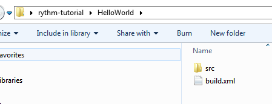
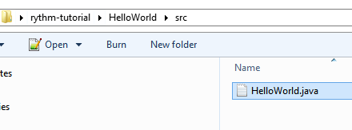

# Tutorial

### [evn]Setup your environment

You need to setup your environment properly to follow this tutorial step by step. Please make you have the following software installed on your machine:

1. Java, JRE or JDK 1.6+

    
    
    <a href="http://www.oracle.com/technetwork/java/javase/downloads/index.html">
        <i class="icon-download">&nbsp;</i>
        <span>Get Java</span>
    </a>

1. Ant 1.7+

    
    
    <a href="http://ant.apache.org/">
        <i class="icon-download">&nbsp;</i>
        <span>Get Ant</span>
    </a>

1. Maven 2 or Maven 3

    
    
    <a href="http://maven.apache.org/">
        <i class="icon-download">&nbsp;</i>
        <span>Get Maven</span>
    </a>
    
1. Rythm. Please follow the [document guide](/doc/index#get) to download latest Rythm distribution package 
and unzip to a local folder, e.g. `C:\`

    

### [hello] Hello world!

Before we heading to our journey, let's first get our feet wet and say "Hello world!" using Rythm.

1. Create a project folder named "HelloWorld", and create a `src` folder under it:

    
    
1. Add an ant `build.xml` file to `HelloWorld` project:

    
    
    And copy the content from [the github version](https://github.com/greenlaw110/Rythm/blob/1.0/samples/HelloWorld/build.xml) to your `build.xml` file
    
1. Add a `build.properties` file to `HelloWorld` project:

    
    
    Put the following lines to the `build.properties` file:
    
    ```properties
    src=src
    lib=lib
    classes=classes
    
    # change this line to make it point to your rythm folder
    rythm.home=c:\\rythm-engine-1.0-b2-SNAPSHOT
    rythm.lib=${rythm.home}/lib
    ```

1. Create the `HelloWorld.java` source file in the `src` folder: 

    
    
    Add the following lines to your first Rythm program:
    
    ```java
    import com.greenlaw110.rythm.Rythm;

    public class HelloWorld {
       public static void main(String[] args) {
           System.out.println(Rythm.render("hello @who!", "rythm"));
       }
    }
    ```

1. Now we are ready, and let's run it:

    
    
    All good, we got the result! But wait, it's `hello rythm!`, not the `Hello World!` as we expected. Let's go back to our program and do a bit changes from
    
    ```java
    System.out.println(Rythm.render("hello @who!", "rythm"));
    ````
    
    to
    
    ```java
    System.out.println(Rythm.render("Hello @who!", "World"));
    ```
    
    and then run again:
    
    
    
    Yes! we made it!
    
    Now let's think about this, should we change our program every time we want to change our content? Obviously not, we should take the template source out of the java source and put into a separate file. So far we didn't see any template source file yet because our template is put inline inside the program. Now let's create an new template file in a new folder `resources`. To make it a bit more fancy, we create it as a web page instead of a plain text file:
    
    
    
    and add some content into the `helloworld.html` file:
    
    ```html
    <html>
    <head>
    <title>Hello world from Rythm</title>
    </head>
    <body>
    <h1>Hello @who</h1>
    </body>
    </html>
    ```

    And we have to change our program to make it render an external template file instead of an inline template content. Let change the line from
    
    ```java
    System.out.println(Rythm.render("Hello @who!", "World"));
    ```
    
    to
    
    ```java
    System.out.println(Rythm.render("helloworld.html", "World"));
    ```
    
    And run the program again and see what we get:
    
    
    
    Oh no, this isn't what we want! What happened? 
    
    The reason is Rythm take "helloworld.html" as a template content rather than an external filename because Rythm cannot find it. Although we have created an external file named `helloworld.html`, we haven't told Rythm where it is. There are 2 ways to tell Rythm to load an external file
    
    1. Set the `rythm.root` property to let Rythm know where the template files are stored. This must be done before calling Rythm to render anything
    1. Put the template file into Java's class path
     
    Let's try `rythm.root` approach first. Change the `HelloWorld.java` file as the follows:
    
    ```java
    import java.util.*;
    import com.greenlaw110.rythm.Rythm;
        
    public class HelloWorld {
       public static void main(String[] args) {
           // use java.util.Properties store the configuration
           Properties p = new Properties();
           // tell rythm the template source files should be found from "resources" folder
           p.setProperty("rythm.root", "resources");
           // init Rythm with our predefined configuration
           Rythm.init(p);
           System.out.println(Rythm.render("helloworld.html", "World"));
       }
    }
    ```

    And run again:

    
    
    Now it comes out what we wanted. 
    
    Next step let's try the class path approach. First revert the `HelloWorld.java` program back to what is previously by commenting out those `rythm.root` configuration lines:
    
    ```java
    import java.util.*;
    import com.greenlaw110.rythm.Rythm;
        
    public class HelloWorld {
        public static void main(String[] args) {
            // use java.util.Properties store the configuration
            //Properties p = new Properties();
            // tell rythm the template source files should be found from "resources" folder
            //p.setProperty("rythm.root", "resources");
            // init Rythm with our predefined configuration
            //Rythm.init(p);
            System.out.println(Rythm.render("helloworld.html", "World"));
        }
    }
    ```

    And do a bit changes in our `build.xml` file under the HelloWorld project root folder. What we want to do is to tell ant we need to copy the `helloworld.html` file from the `resources` folder to the `classes` folder before running the program. Let's add the following line
    
    ```html
    <copy file="resources/helloworld.html" todir="${classes}"/>
    ```
    
    to the `init` target in the `build.xml` file, right above the closing `</target>` tag. After you have finished the `init` target should looks like the follows:
    
    ```xml
    <target name="init">
       <tstamp/>
       <mkdir dir="${classes}"/>
       <copy file="resources/helloworld.html" todir="${classes}"/>
    </target>
    ```

    And then run the program again, you should get the same result as previous.
    
    Now let's stop for a while and summarize what we have learned from `HelloWorld` project so far
    
    1. Calling to `Rythm.render()` will cause Rythm to process a template with a supplied parameter and return the result
    2. template is passed into `Rythm.render` as the first parameter, it could be either an inline template content (`Hello @who!`), or an external template file name (`helloworld.html`)
    3. the template argument is passed into `Rythm.render()` following the template parameter (the first parameter)
    
    Now let's put a little challenge on our `HelloWorld` project. We want the template not only say "Hello", but also be able to say "Greeting" depend on user's input. First change the following line in our "helloworld.html" template file:
    
    ```html
    <h1>Hello @who</h1>
    ```
    
    to
    
    ```html
    <h1>@action @who</h1>
    ``` 
    
    Meaning we don't hard code "Hello" in our template, rather, we add a template argument `@action` so user can change the output of the template by passing different `@action` to the template. 
    
    Then go to the Java file and add one more parameter to the render line of `HelloWorld.java` program so it changed from:
    
    ```java
    System.out.println(Rythm.render("helloworld.html", "World"));
    ```
    
    to 
    
    ```java
    System.out.println(Rythm.render("helloworld.html", "World", "Greeting"));
    ```
    
    Run the program we get
    
    
    
    See there is a problem in the result, we want to say "Greeting World" and it becomes "World Greeting", this is because the argument `@action` appears earlier before argument `@who` in the template source. So just swap the "World" and "Greeting" in the `HelloWorld.java` will fix the problem.
    
    But what if a template has a lot of arguments in which case we want to use the argument name instead of position to pass the parameters, and yes Rythm support passing template arguments by name. Here is the new `HelloWorld.java`:
    
    ```java
    import java.util.*;
    import com.greenlaw110.rythm.Rythm;
        
    public class HelloWorld {
       public static void main(String[] args) {
           Map<String, Object> params = new HashMap<String, Object>(2);
           params.put("who", "World");
           params.put("action", "Greeting");
           System.out.println(Rythm.render("helloworld.html", params));
       }
    }
    ```

    After you putting the new version to your `HelloWorld.java` file, run the program again. This time we got the correct output:
    
    
    
    Before we wrap up our `HelloWorld` project, we play specifically with Rythm's special `@` character. Let's suppose the user design a template where he put an email address inside. As we know all email address contains the `@` character. What will happen if we update our template and add an email address like follows:
    
    ```html
    <html>
    <head>
    <title>Hello world from Rythm</title>
    </head>
    <body>
    <h1>@action @who</h1>
    <p>Please contact me at green@rythmengine.com</p>
    </body>
    </html>
    ```

    Run the program we get this:
    
    
    
    hmm... what the hell it is, why it says '`action cannot be resolved to a variable`'. Since this is a bit tricky to explain I will leave it there at the moment. For now just to understand it is caused by the email address `green@rythmengine.com`, specifically caused by `@rythmengine.com`. To fix the problem put one additional `@` to `@rythmengine.com`, so the email address in a template changes to `green@@rythmengine.com`. Double `@` tell rythm that this is not the special character to lead a syntax element, but rather a literal `@` sign. When you finish changing the template source run the program again and it shows the good result:
    
    
    
    Alright I think it is enough for us to wrap up the `HelloWorld` project. We have learned a lot of things about Rythm though this tiny project:
    
    1. Calling to `Rythm.render()` will cause Rythm to process a template with a supplied parameter and return the result
    1. template is passed into `Rythm.render` as the first parameter, it could be either an inline template content (`Hello @who!`), or an external template file name (`helloworld.html`)
    1. the template argument is passed into `Rythm.render()` following the template parameter (the first parameter)
    1. `Rythm.render()` accept passing template parameters by position or by name. Use `Map<String, Object>` to pass the parameters by name
    1. If you need to show the special `@` sign in the template directly, double it.
    
    For the next step we are going to do something serious!

### [bookstore]Duke's bookstore

Duke's bookstore is coming soon. Stay tuned!
